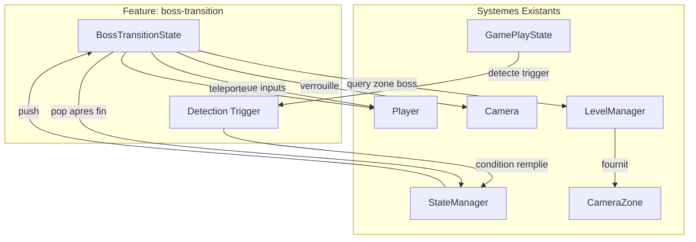
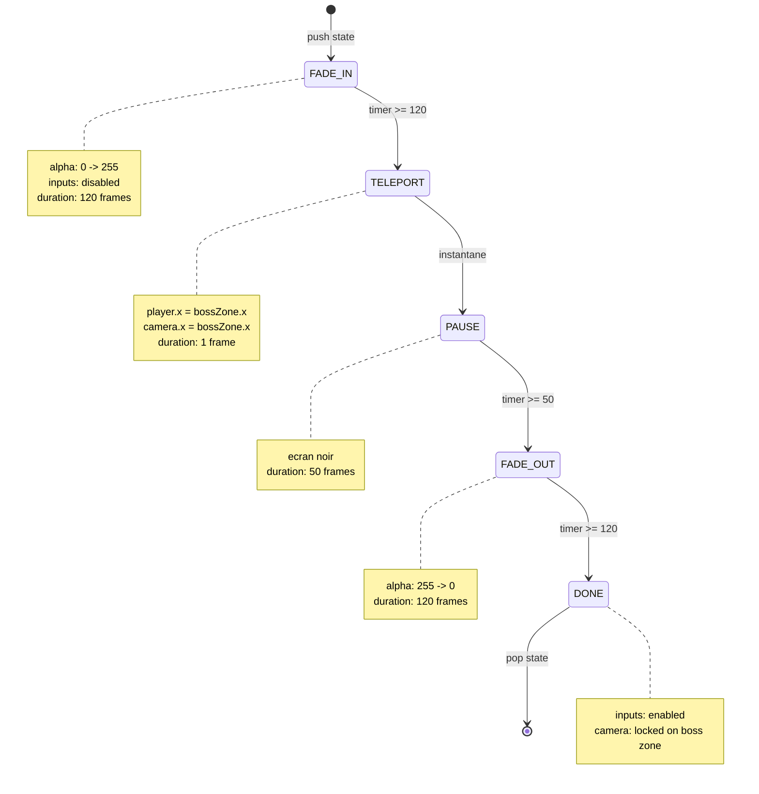
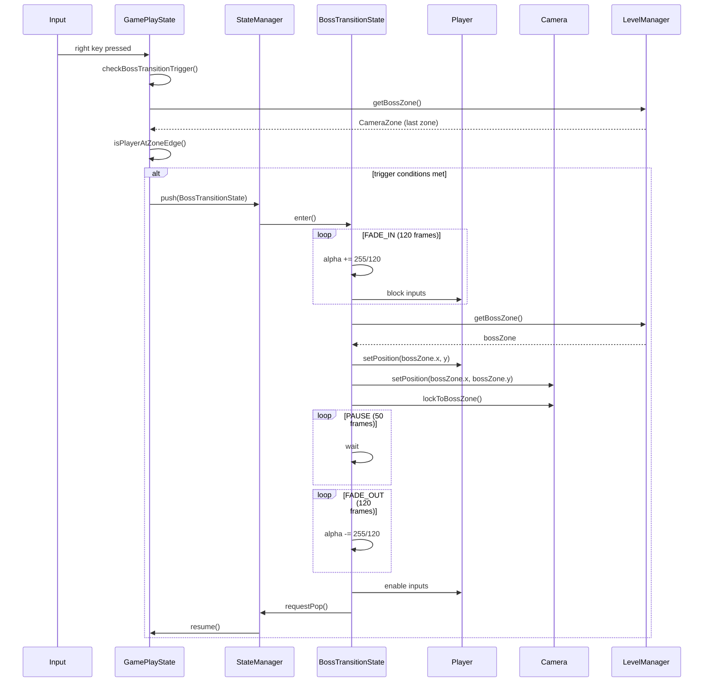
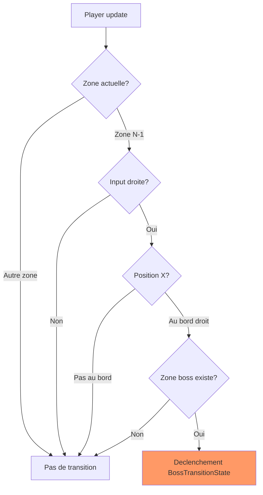
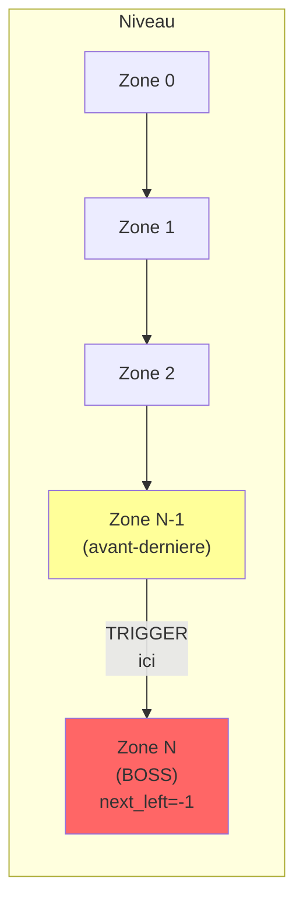

# Diagrammes: boss-transition

## 1. Architecture des Composants

## 2. State Machine - BossTransitionState

## 3. Sequence d'Execution

## 4. Detection du Trigger

## 5. Layout des Zones

## 6. Timeline de la Transition

```mermaid
gantt
    title Timeline Boss Transition (290 frames total)
    dateFormat X
    axisFormat %s

    section Inputs
    Disabled           :active, 0, 290

    section Visual
    Fade In (0->noir)  :crit, 0, 120
    Noir complet       :120, 170
    Fade Out (noir->0) :crit, 170, 290

    section Position
    Zone N-1           :0, 120
    Teleport           :milestone, 120, 120
    Zone Boss          :120, 290

    section Camera
    Suivant joueur     :0, 120
    Lock boss zone     :120, 290
```

