# Dynamic Level Loading - Diagrams

**Feature:** Chargement dynamique de niveaux
**Version:** 1.0
**Date:** 2026-01-15

---

## 1. Architecture Globale

### 1.1 Vue d'ensemble des composants

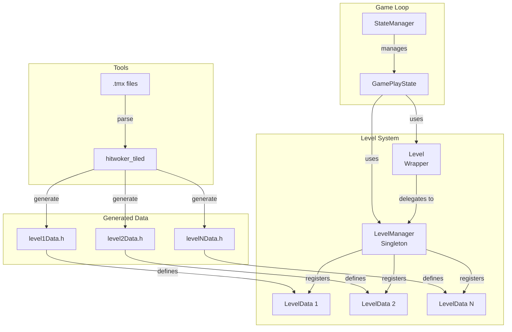

### 1.2 Dependances entre fichiers

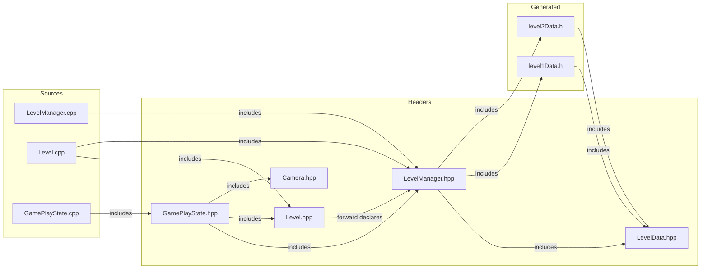

---

## 2. Structure LevelData

### 2.1 Composition de la struct

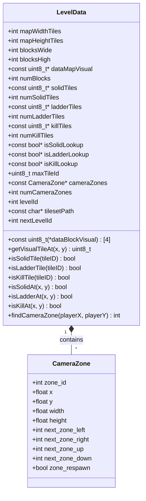

### 2.2 Memoire et pointeurs

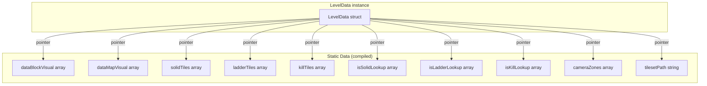

---

## 3. LevelManager

### 3.1 Classe et relations

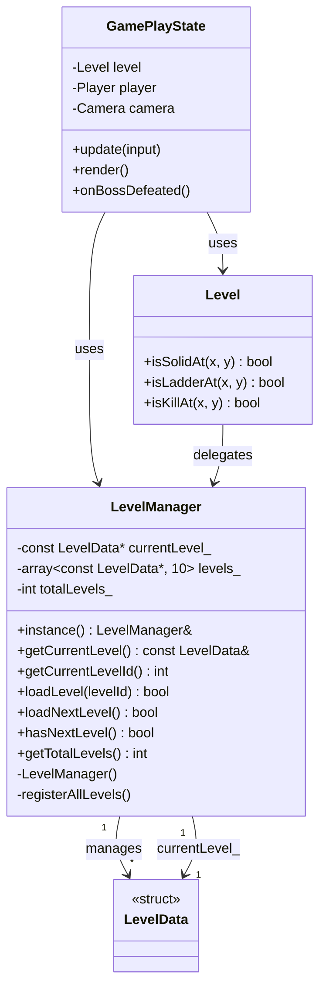

### 3.2 Singleton pattern

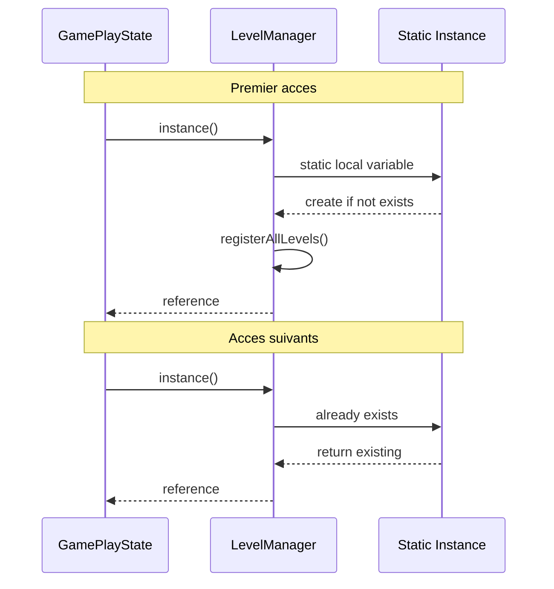

---

## 4. Flux de donnees

### 4.1 Acces aux tiles (rendu)

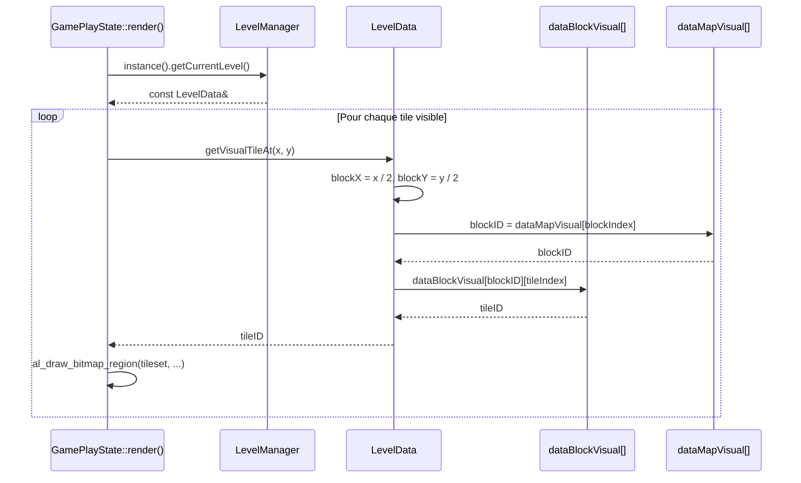

### 4.2 Verification collision

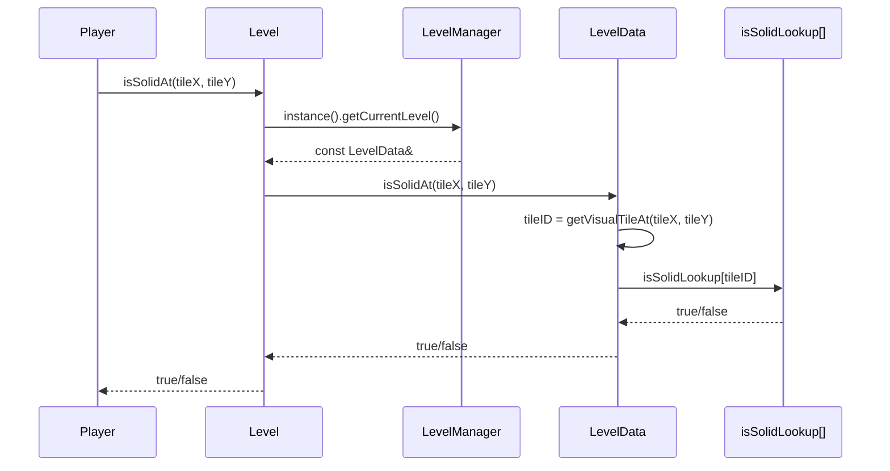

---

## 5. Transition de niveau

### 5.1 Sequence complete

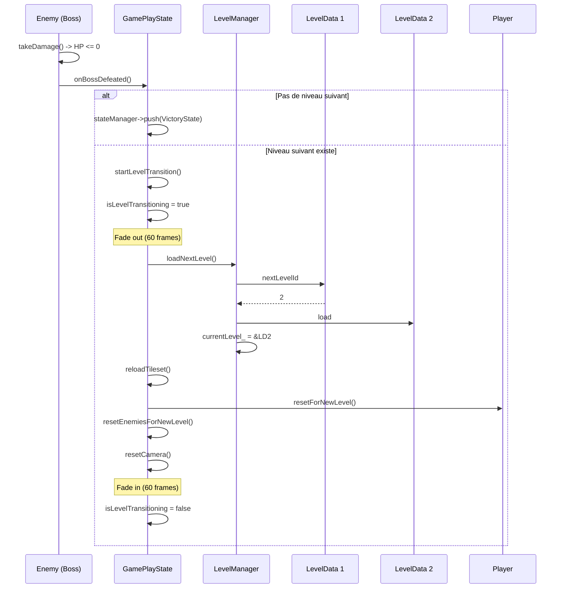

### 5.2 Etats de transition

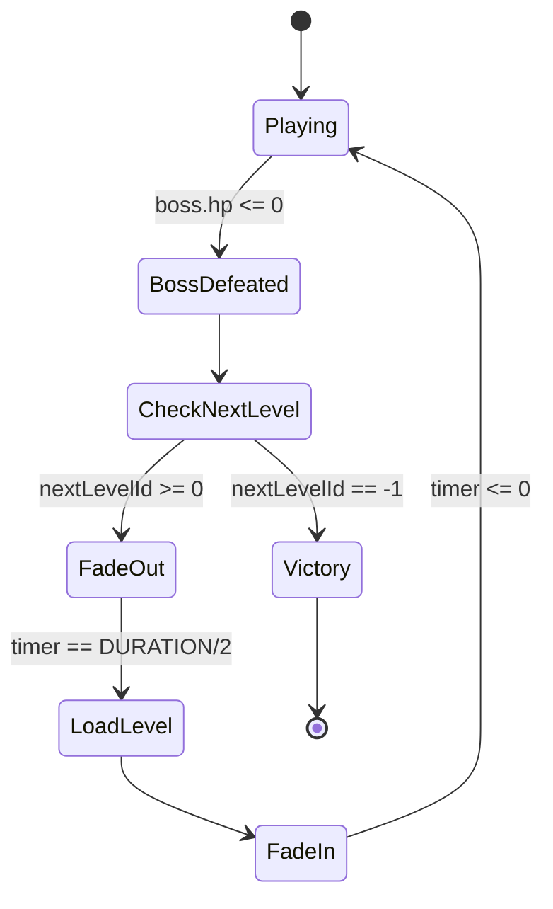

---

## 6. Generation des donnees

### 6.1 Pipeline hitwoker_tiled

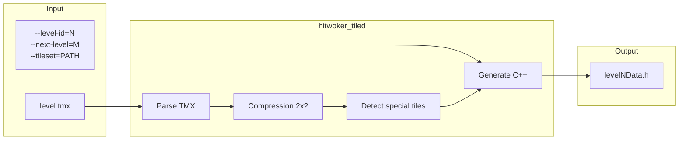

### 6.2 Structure du fichier genere

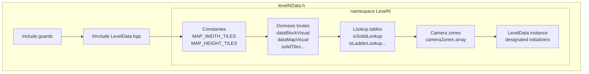

---

## 7. Comparaison Avant/Apres

### 7.1 Architecture actuelle

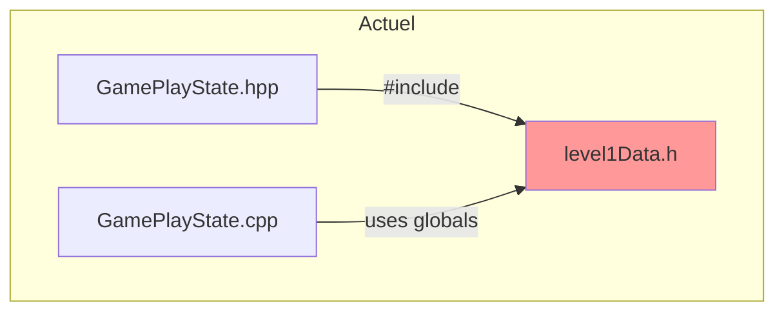

### 7.2 Architecture proposee

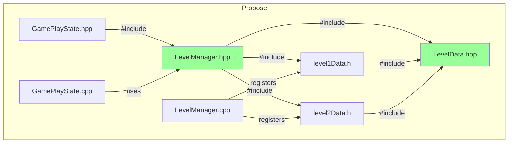

---

## 8. Diagramme de classes complet

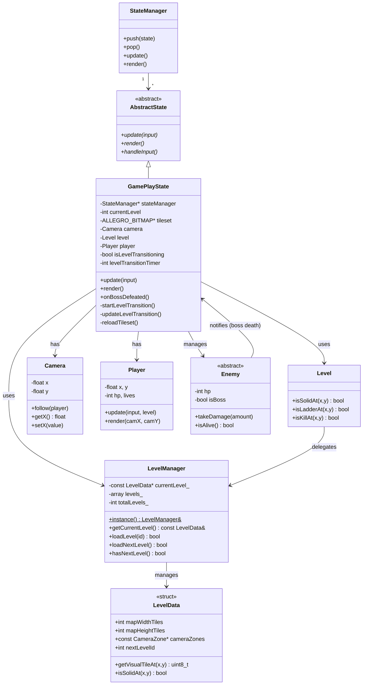

---

## 9. Memory Layout

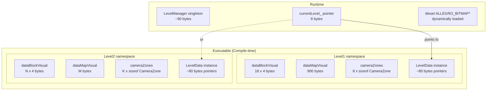

---

## Notes

- Tous les diagrammes utilisent Mermaid (compatible GitHub, GitLab, etc.)
- La struct `LevelData` utilise des pointeurs vers des donnees statiques pour eviter la copie
- Le singleton `LevelManager` est thread-safe grace a la construction lazy de C++11+
- Les transitions de niveau ne liberent pas la memoire des anciens niveaux (donnees compilees)
