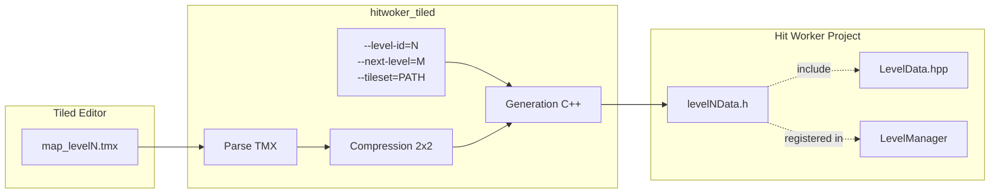
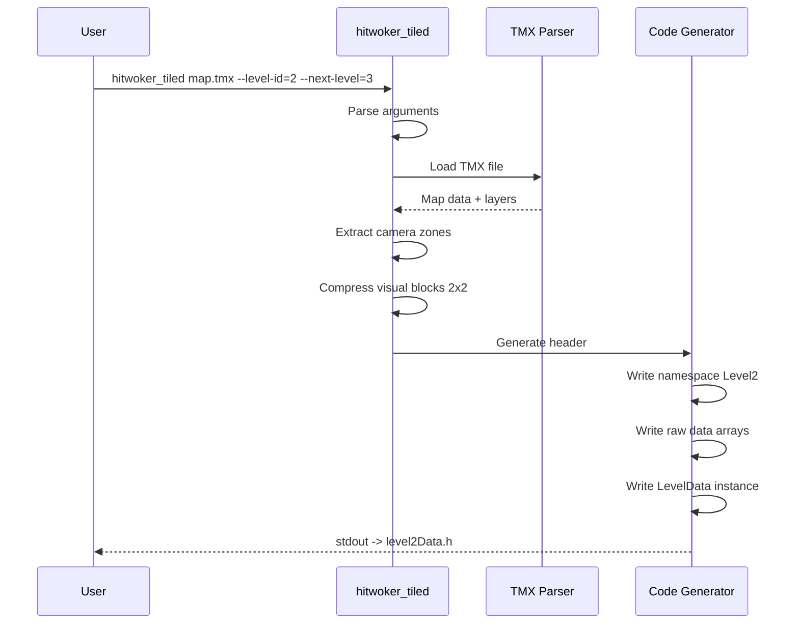
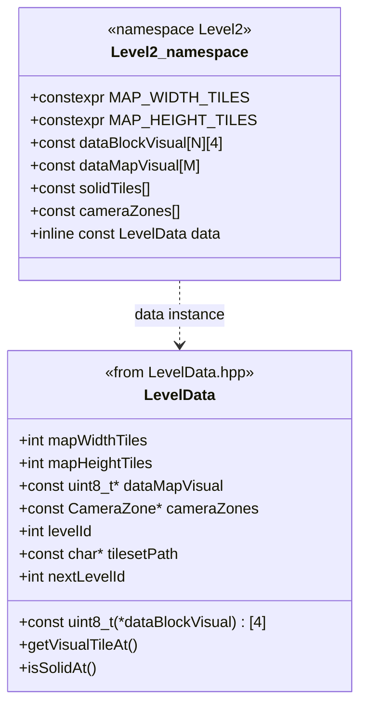
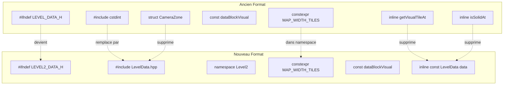

# Diagrammes: hitwoker-tiled-leveldata

## 1. Architecture du Pipeline



## 2. Flux de Generation



## 3. Structure du Code Genere



## 4. Comparaison Ancien vs Nouveau Format



## 5. Arguments CLI

```
hitwoker_tiled <fichier.tmx> [options]

Options:
  --level-id=N      ID du niveau (defaut: 1)
                    Utilise pour: namespace LevelN, header guard LEVELN_DATA_H

  --next-level=N    ID du niveau suivant (defaut: -1)
                    -1 = dernier niveau
                    Utilise pour: LevelData.nextLevelId

  --tileset=PATH    Chemin du tileset (defaut: "asset/level/tileset/1.jpg")
                    Utilise pour: LevelData.tilesetPath

Exemple:
  hitwoker_tiled map2.tmx --level-id=2 --next-level=3 --tileset="asset/level/tileset/2.jpg"
```
